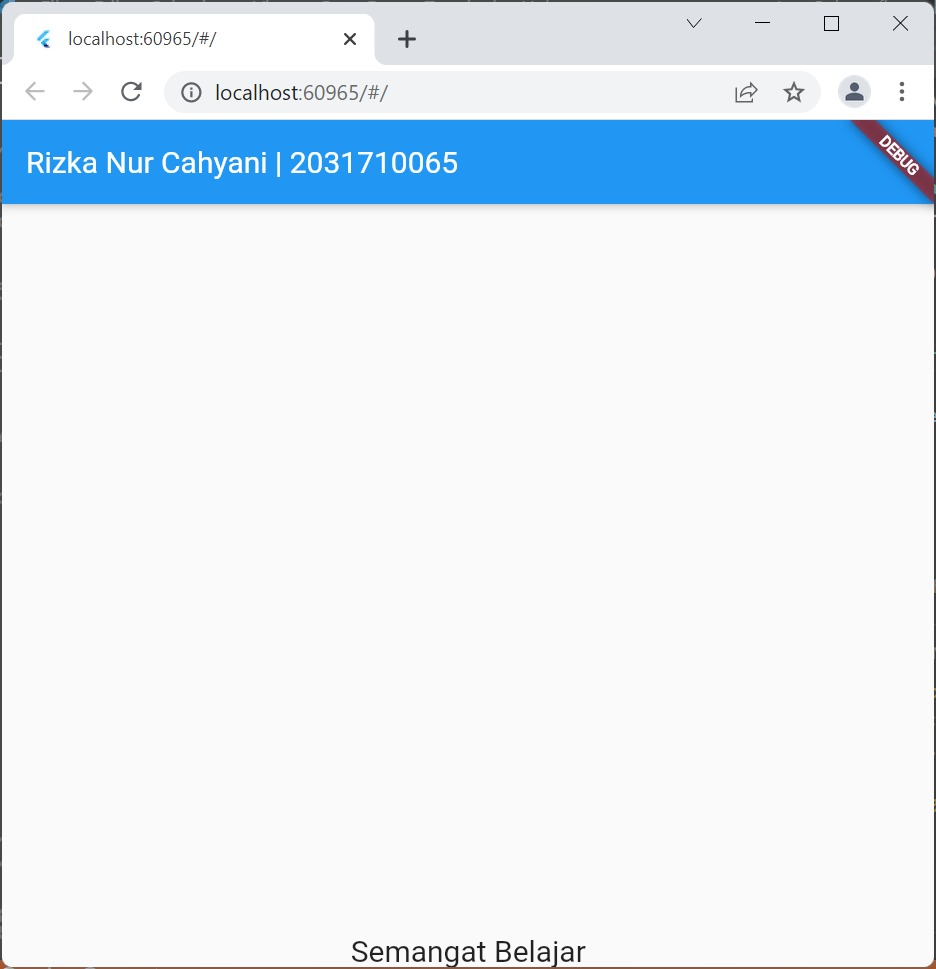
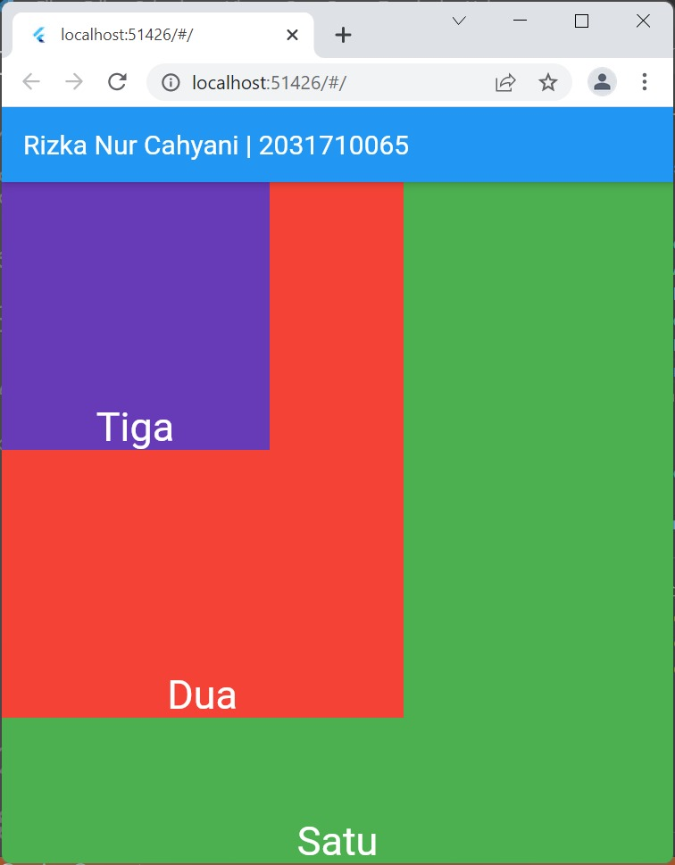

# Tugas 2 Pemrograman Mobile

Nama : Rizka Nur Cahyani  
NIM  : 2031710065  
Kelas : MI-2C  

## Hasil Praktikum

### 1. Text Widget

 

### 2. Image Widget

 

### 3. Material Design dan iOS Cupertino

 

### 4. Button

 

### 5. Scaffold

 

### 6. Dialog

 

### 7. Input dan Selection Widget

 

### 8. Date and Time Pickers

 

### 9. Container Property Child

 

### 10. Container Property Alignment

 

### 11. Container Property Color

 

### 12. Container Property Height dan Width 

 

### 13. Container Property Margin

 

### 14. Container Property Padding

 

### 15. Container Property Transform 

 

### 16. Container Property Decoration

 

### 17. Column Widget

 

### 18. Row Widget 

 

### 19. Stack 

 

### 20. ListView

 

### 21. GridView

 

### Tugas

 

 
